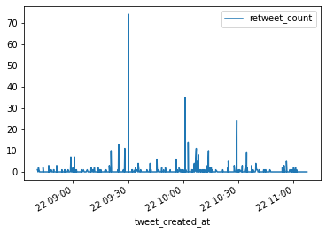

# Bitcoin Twitter
> What is the twittersphere saying about bitcoin?


## Install

`pip install git+https://github.com/maimanuel/bitcoin_twitter`

## How to use

This package uses the twitter api and will require that you have API and Secret API keys.
Create a `twitter_credentials.py` file containing least the following two lines
```python
CONSUMER_KEY = '' # Api Key in quotes
CONSUMER_SECRET = '' # API Secret Key in quotes
```

This file will be imported as a python module. If you are working with github, it is advised to include your credentials file in `twitter_credentials.py` your `.gitignore`, to never push it to github.

> Don't commit your credentials file before it's added to `.gitignore`

## Set up a connection


```python
#local
from twitter_credentials import CONSUMER_KEY,CONSUMER_SECRET 
```

```python
#local
conn = connector(consumer_key=CONSUMER_KEY, consumer_secret=CONSUMER_SECRET)
```

## Get a dataframe of tweets

```python
#local
df_tweets = conn.get_tweets()
df_tweets.head()
```


<div>
<style scoped>
    .dataframe tbody tr th:only-of-type {
        vertical-align: middle;
    }

    .dataframe tbody tr th {
        vertical-align: top;
    }

    .dataframe thead th {
        text-align: right;
    }
</style>
<table border="1" class="dataframe">
  <thead>
    <tr style="text-align: right;">
      <th></th>
      <th>tweet_id</th>
      <th>tweet_text</th>
      <th>tweet_created_at</th>
      <th>tweet_user_id</th>
      <th>user_name</th>
      <th>user_screen_name</th>
      <th>retweet_count</th>
      <th>tweet_geo</th>
      <th>tweet_coordinates</th>
    </tr>
  </thead>
  <tbody>
    <tr>
      <th>0</th>
      <td>1275003968305926145</td>
      <td>400%+ Profit from Last Month's Calls🚀🔥\n\nFor ...</td>
      <td>2020-06-22 09:53:29</td>
      <td>1271670218842992641</td>
      <td>Kaya</td>
      <td>cryptoexp32562A</td>
      <td>0</td>
      <td>None</td>
      <td>None</td>
    </tr>
    <tr>
      <th>1</th>
      <td>1275003910256824326</td>
      <td>$OST\n\n$btc #btc #bitcoin #altcoins https://t...</td>
      <td>2020-06-22 09:53:15</td>
      <td>115516978</td>
      <td>Crypto Ranger</td>
      <td>Crypto_Ranger85</td>
      <td>0</td>
      <td>None</td>
      <td>None</td>
    </tr>
    <tr>
      <th>2</th>
      <td>1275003872726200322</td>
      <td>The Institutional Smart-Money Is Trapping Unex...</td>
      <td>2020-06-22 09:53:06</td>
      <td>1142737563481980931</td>
      <td>Vince Prince</td>
      <td>VincePrince244</td>
      <td>0</td>
      <td>None</td>
      <td>None</td>
    </tr>
    <tr>
      <th>3</th>
      <td>1275003856104153088</td>
      <td>Gov’t threatens to take action vs #cryptocurre...</td>
      <td>2020-06-22 09:53:02</td>
      <td>735038454262730752</td>
      <td>Fintech Philippines</td>
      <td>FintechPH</td>
      <td>0</td>
      <td>None</td>
      <td>None</td>
    </tr>
    <tr>
      <th>4</th>
      <td>1275003823824629760</td>
      <td>#Bitcoin might fall to $8,400 soon as #BTC tra...</td>
      <td>2020-06-22 09:52:54</td>
      <td>2338229497</td>
      <td>BTCC</td>
      <td>YourBTCC</td>
      <td>0</td>
      <td>None</td>
      <td>None</td>
    </tr>
  </tbody>
</table>
</div>


You can also modify the search query to, for example, only find popular tweets by adding the query paramter `result_type=popular`

```python
#local
query = '#Bitcoin -filter:retweets lang:en result_type=popular'
df_tweets = conn.get_tweets(query=query,n_items=10000)
```

```python
#local
df_tweets.tail()
```


<div>
<style scoped>
    .dataframe tbody tr th:only-of-type {
        vertical-align: middle;
    }

    .dataframe tbody tr th {
        vertical-align: top;
    }

    .dataframe thead th {
        text-align: right;
    }
</style>
<table border="1" class="dataframe">
  <thead>
    <tr style="text-align: right;">
      <th></th>
      <th>tweet_id</th>
      <th>tweet_text</th>
      <th>tweet_created_at</th>
      <th>tweet_user_id</th>
      <th>user_name</th>
      <th>user_screen_name</th>
      <th>retweet_count</th>
      <th>tweet_geo</th>
      <th>tweet_coordinates</th>
    </tr>
  </thead>
  <tbody>
    <tr>
      <th>995</th>
      <td>1275017093570801664</td>
      <td>I see a lot of #fud regarding #bch \n\nI don’t...</td>
      <td>2020-06-22 10:45:38</td>
      <td>950480284377546752</td>
      <td>Professor Freedom 🛡</td>
      <td>BTC__Blockchain</td>
      <td>0</td>
      <td>None</td>
      <td>None</td>
    </tr>
    <tr>
      <th>996</th>
      <td>1275016992517480449</td>
      <td>Say no to shitcoins; say yes to #bitcoin https...</td>
      <td>2020-06-22 10:45:14</td>
      <td>721964509078937600</td>
      <td>21 Million 🔴 🚀</td>
      <td>Cipherhoodlum</td>
      <td>0</td>
      <td>None</td>
      <td>None</td>
    </tr>
    <tr>
      <th>997</th>
      <td>1275016966986661889</td>
      <td>This is not 2009. But this is better than Bitc...</td>
      <td>2020-06-22 10:45:08</td>
      <td>4045549725</td>
      <td>Robin Lift</td>
      <td>RobinLift</td>
      <td>0</td>
      <td>None</td>
      <td>None</td>
    </tr>
    <tr>
      <th>998</th>
      <td>1275016958748930048</td>
      <td>Calm Before The Storm? 5 Bitcoin Price Factors...</td>
      <td>2020-06-22 10:45:06</td>
      <td>1255271270</td>
      <td>BitValley</td>
      <td>VernonBitValley</td>
      <td>0</td>
      <td>None</td>
      <td>None</td>
    </tr>
    <tr>
      <th>999</th>
      <td>1275016948720349184</td>
      <td>Bitmain Co-Founder Offers Share Buyback at $4B...</td>
      <td>2020-06-22 10:45:03</td>
      <td>1255271270</td>
      <td>BitValley</td>
      <td>VernonBitValley</td>
      <td>0</td>
      <td>None</td>
      <td>None</td>
    </tr>
  </tbody>
</table>
</div>


```python
df_tweets.shape
```


    (1000, 9)


For more information on twitter search please consult the twitter [standard search operator reference](https://developer.twitter.com/en/docs/tweets/search/guides/standard-operators), the twitter [standard search API reference](https://developer.twitter.com/en/docs/tweets/search/api-reference/get-search-tweets), and the [tweepy Api reference](http://docs.tweepy.org/en/latest/index.html).                                                          

```python
df_tweets.plot(x='tweet_created_at',y='retweet_count')
```


    <matplotlib.axes._subplots.AxesSubplot at 0x126a1a710>




